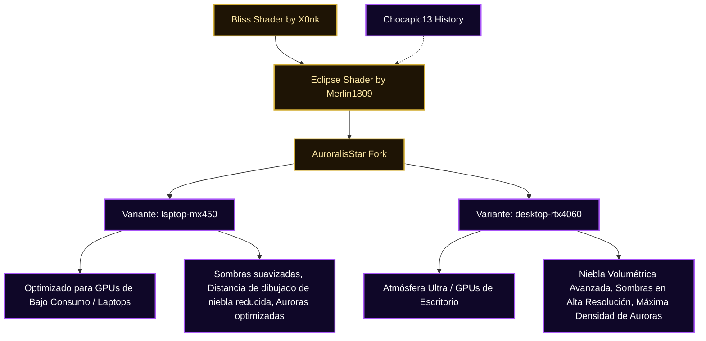

# AuroralisStar — Shaders Atmosféricos de Minecraft

<p align="center">
  
</p>

**AuroralisStar** es un fork experimental de shaders para Minecraft enfocado en identidad visual, atmósfera cósmica y optimización/presets calibrados para hardware específico.

El proyecto nace para empujar la dirección artística hacia cielos más vivos con auroras boreales prominentes, nieblas volumétricas dramáticas, color grading cinematográfico y perfiles dedicados para escenarios reales de rendimiento.

---

## 🎨 Filosofía y Diferencias del Upstream

AuroralisStar busca resolver una necesidad recurrente en la comunidad de Minecraft: ¿Cómo lograr una atmósfera visual de altísima gama sin recurrir a configuraciones universales pesadas o genéricas?

Este fork introduce cambios profundos de calibración visual respecto al código base:
*   **Auroras Boreales Protagonistas:** Reajuste del renderizado celeste para mostrar auroras en tonos violeta, púrpura y destellos dorados con mayor presencia.
*   **Niebla y Haze Atmosférico:** Densidad de niebla aumentada y mejor dispersión de luz en bosques y biomas húmedos para dar profundidad tridimensional.
*   **Paleta de Color Cinematográfica:** Tonos verdes de vegetación más fríos y realistas con luces de antorchas y sol más cálidas y doradas.
*   **Optimización Segmentada por Hardware:** En lugar de un pack único que corre lento en laptops y subutiliza PCs de escritorio, AuroralisStar se divide en dos variantes calibradas a nivel de código GLSL.

---

## 🧬 Linaje y Arquitectura de Variantes

El siguiente diagrama ilustra el linaje de desarrollo del shader y cómo se ramifican las variantes técnicas:



---

## 📂 Contenido del Repositorio

El repositorio está organizado para permitir el ajuste y pruebas independientes en cada canal de hardware:

```text
AuroralisStar/
|-- [README.md](file:///C:/Users/pablo/Documentos/GitHub/AuroralisStar/README.md)
|-- [CREDITS.md](file:///C:/Users/pablo/Documentos/GitHub/AuroralisStar/CREDITS.md)
|-- [assets/](file:///C:/Users/pablo/Documentos/GitHub/AuroralisStar/assets/)
|   `-- hero.svg
|-- [laptop-mx450/](file:///C:/Users/pablo/Documentos/GitHub/AuroralisStar/laptop-mx450/)
|   |-- README.md
|   |-- CODEX_PRESET_NOTE.txt
|   `-- shaders/
`-- [desktop-rtx4060/](file:///C:/Users/pablo/Documentos/GitHub/AuroralisStar/desktop-rtx4060/)
    |-- README.md
    |-- CODEX_PRESET_NOTE.txt
    `-- shaders/
```

---

## 💻 Análisis Detallado de las Variantes

### 1. Variante Laptop (`laptop-mx450/`)
Diseñada específicamente para GPUs dedicadas de bajo perfil (como la NVIDIA GeForce MX450) y procesadores móviles con gráficos integrados avanzados.
*   **Enfoque:** Fluidez en juego (objetivo estable de 60 FPS a 1080p).
*   **Ajustes GLSL:**
    *   Filtros de sombras suavizados por hardware de menor resolución (`shadowMapResolution = 1024`).
    *   Niebla volumétrica simplificada con menos pasos de muestreo en Session 0.
    *   Auroras optimizadas para evitar sobrecarga de shaders de fragmentos.

### 2. Variante Desktop (`desktop-rtx4060/`)
Diseñada para tarjetas de gama media/alta de escritorio (como la NVIDIA GeForce RTX 4060 y superiores) que soportan trazado y efectos volumétricos complejos sin caídas notables.
*   **Enfoque:** Máxima fidelidad visual y captura cinematográfica.
*   **Ajustes GLSL:**
    *   Sombras de alta definición (`shadowMapResolution = 2048` o superior) con filtrado suave de penumbra dinámico.
    *   Niebla volumétrica con simulación de dispersión de luz física real y rayos solares crepusculares.
    *   Toda la intensidad y capas superpuestas de auroras activas en el cielo nocturno.

---

## 🚀 Cargador y Requisitos Recomendados

Para un rendimiento óptimo en Minecraft Java Edition:
1.  **Cargador:** [Iris Shaders](https://irisshaders.dev/) (permite la recarga en tiempo real y lee directamente las carpetas de desarrollo).
2.  **Optimización:** [Sodium](https://github.com/CaffeineMC/sodium-fabric) como dependencia base obligatoria.
3.  **Instalación:** Copia la carpeta `laptop-mx450` o `desktop-rtx4060` directamente en tu carpeta de `.minecraft/shaderpacks/`.

---

## 👥 Créditos y Agradecimientos

AuroralisStar reconoce y respeta el excelente trabajo previo de la comunidad de creadores de shaders. Las bases matemáticas y de renderizado provienen de:
*   **Eclipse Shader** desarrollado por Merlin1809.
*   **Bliss Shader** desarrollado por X0nk.
*   Modelos de iluminación tradicionales heredados del histórico **Chocapic13**.

Para más detalles sobre patentes y atribución, consulte [CREDITS.md](file:///C:/Users/pablo/Documentos/GitHub/AuroralisStar/CREDITS.md).

<!-- Updated for 2026 active baseline maintenance -->
